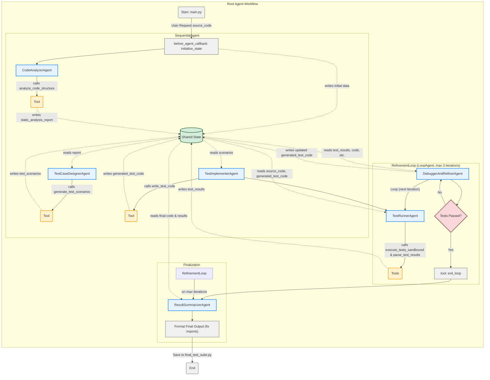

```mermaid

graph TD
    classDef agent fill:#e6f3ff,stroke:#007bff,stroke-width:2px;
    classDef tool fill:#fff2cc,stroke:#ff9900,stroke-width:2px;
    classDef state fill:#d4edda,stroke:#155724,stroke-width:2px,shape:cylinder;
    classDef decision fill:#f8d7da,stroke:#721c24,stroke-width:2px,shape:rhombus;
    classDef io fill:#f0f0f0,stroke:#333,shape:parallelogram;
    classDef flow fill:#f0f0f0,stroke:#333;

    subgraph CoordinatorAgent [Root Agent Workflow]
        direction TB

        Start(Start: main.py) --> |User Request source_code| Init["before_agent_callback: initialize_state"]
        Init -.-> |writes initial data| StateDB[(Shared State)]

        subgraph GenerationPipeline [SequentialAgent]
            Init --> Analyzer[CodeAnalyzerAgent]
            Analyzer --> |calls analyze_code_structure| T1(Tool)
            T1 -.-> |writes static_analysis_report| StateDB

            StateDB -.-> |reads report| Designer[TestCaseDesignerAgent]
            Designer --> |calls generate_test_scenarios| T2(Tool)
            T2 -.-> |writes test_scenarios| StateDB

            StateDB -.-> |reads scenarios| Implementer[TestImplementerAgent]
            Implementer --> |calls write_test_code| T3(Tool)
            T3 -.-> |writes generated_test_code| StateDB
        end

        subgraph "RefinementLoop (LoopAgent, max 3 iterations)"
            Implementer --> Runner[TestRunnerAgent]
            StateDB -.-> |reads source_code, generated_test_code| Runner
            Runner --> |calls execute_tests_sandboxed & parse_test_results| T4(Tools)
            T4 -.-> |writes test_results| StateDB

            StateDB -.-> |reads test_results, code, etc.| Debugger[DebuggerAndRefinerAgent]
            Debugger --> Decision{Tests Passed?}

            Decision -- "No" --> Debugger
            Debugger -.-> |writes updated generated_test_code| StateDB
            Debugger -- "Loop (next iteration)" --> Runner

            Decision -- "Yes" --> ExitLoop["tool: exit_loop"]
        end

        subgraph Finalization
            ExitLoop --> Summarizer[ResultSummarizerAgent]
            RefinementLoop -- "on max iterations" --> Summarizer
            StateDB -.-> |reads final code & results| Summarizer
            Summarizer --> FinalOutput["Format Final Output (fix imports)"]
        end
    end

    FinalOutput --> |Save to final_test_suite.py| End(End)

    class Start,End,Init,FinalOutput,ExitLoop flow;
    class Analyzer,Designer,Implementer,Runner,Debugger,Summarizer agent;
    class T1,T2,T3,T4 tool;
    class StateDB state;
    class Decision decision;
```